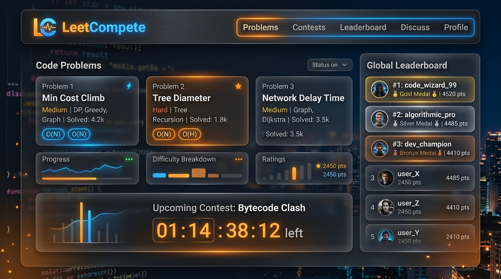
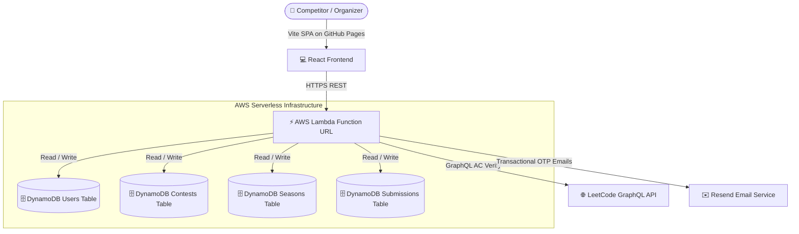

# 🏆 LeetCompete

<div align="center">



**A modern, serverless competitive programming platform to host custom LeetCode matches, build 150-problem season leagues with zero question repetition, and verify Accepted (AC) submissions in real-time via LeetCode GraphQL.**

[](https://fahad-israr.github.io/leetcompete/)
[](https://pcsck7dh7scehbzea2tjotus5e0covcr.lambda-url.us-east-1.on.aws/)
[](LICENSE)

[🌐 Launch Live App](https://fahad-israr.github.io/leetcompete/) • [📖 Feature Guide](#-key-features) • [🏗️ Architecture](#️-architecture--system-design) • [🚀 Deployment](#-quick-setup--deployment-guide)

</div>

---

## 🌟 Key Features

### 1. 🌐 Public Matches & 🔒 Password-Protected Private Arenas
* **Zero Registration for Competitors**: Match participants enter lobbies instantly with just a **Contest Alias** and their **LeetCode Handle**—no account signup or passwords required for players.
* **Dual Access Types**: Host open community matches or password-protected private lobbies for study groups, classrooms, and coding clubs.
* **Auto-Generated Match Titles**: Automatically creates clean, timestamped match titles (e.g. `LeetCompete Match • Aug 16, 18:09 UTC` or `Blind 75 — Round #2`).
* **Custom Match Durations**: Built-in duration presets (30m, 60m, 90m, 120m) with live synchronized countdown clocks.

---

### 2. 👁️ Anti-Spoiler Problem Reveal & Auto-Draw
* **Hidden/Blurred by Default**: Auto-drawn questions in the contest creation tray are automatically blurred to prevent the host from being spoiled on problem choices before the match begins.
* **Vector Eye Controls**: Interactive custom vector eye toggle (`👁️` Reveal / `🙈` Hide) for both per-question inspection and batch `Reveal All` / `Hide All` controls.
* **Flexible Draw Configurations**: Set custom quotas for **Easy**, **Medium**, and **Hard** problems (default: 1 Easy, 2 Medium, 1 Hard) or import problems via URL.

---

### 3. 🔒 Privacy-Preserving Leaderboard & Anti-Stalking Handles
* **Confidential LeetCode Handles**: Competitor LeetCode handles are kept **100% confidential** on the backend and are never displayed on public leaderboards or chat rooms.
* **Contestant Aliases**: Competitors choose a custom display name / alias (up to 25 characters) that represents them on the live scoreboard.
* **Persistent Browser Remembering**: Contest aliases and handles are saved to browser `localStorage` and automatically prefilled across all future matches with a 1-click `✏️ Edit` badge.

---

### 4. 🔑 Creator / Organizer Password Controls
* **In-Arena Password Management**: The match creator/organizer can view, toggle reveal/hide, and copy the private contest password directly from the arena header.
* **1-Click Share**: Copying the lobby invite automatically formats the full link with the password included for easy distribution.
* **Creator Bypass**: Organizers automatically bypass password lockouts on matches they host.

---

### 5. 🏆 Season Leagues & Zero Question Repetition
* **Curriculum Tracking**: Create structured league seasons (e.g. *Blind 75*, *Top Interview 150*, or custom company lists).
* **Unseen Problem Partitioning**: Each round automatically draws exclusively from the *remaining unseen pool*, guaranteeing zero problem repetition across the entire season.
* **Interactive Coverage Progress**: Live progress bars tracking curriculum completion percentage and round history.

---

### 6. ⚡ Automated Serverless AC Verification
* **Real-Time LeetCode GraphQL Checks**: Contestants click *"Solve on LeetCode"*, submit their solution, and click *"Submit"* in LeetCompete.
* **Instant Verification**: AWS Lambda queries LeetCode's public GraphQL endpoint, verifies that an **Accepted (AC)** submission occurred during the active match window, and computes penalty time.
* **Celebration Confetti**: Triggers dynamic canvas confetti animations upon successful solve verification.

---

### 7. 📧 Organizer Authentication & Resend OTP Verification
* **Email & Password Only**: Organizers register with just their email address and password (no LeetCode handle required).
* **Email OTP Verification**: Delivers 6-digit verification codes via the Resend API with clean code badges.
* **Abuse Protection & Rate Limiting**: Built-in 10-request per 12-hour email & client rate limiting.

---

## 🏗️ Architecture & System Design



### Repository Structure

```
.
├── backend/                  # AWS Lambda + DynamoDB serverless backend
│   ├── index.js              # REST API router, DynamoDB handlers & verification engine
│   ├── leetcode.js           # LeetCode GraphQL verification client
│   ├── problemBank.js        # Problem catalogs & non-repeating partition logic
│   ├── serverless.yml        # Serverless Framework configuration & DynamoDB table definitions
│   └── deploy.bat / deploy.sh# One-click deployment scripts
│
├── frontend/                 # React Single Page Application (GitHub Pages)
│   ├── src/
│   │   ├── components/       # LobbyArena, Leaderboard, ProblemPicker, Seasons, AuthModal
│   │   ├── services/api.js   # Client REST service connected to AWS Lambda
│   │   ├── App.jsx           # Main routing & state coordinator
│   │   └── index.css         # Glassmorphism dark mode design system
│   └── vite.config.js        # Configured for GitHub Pages subpath routing
│
└── docs/                     # Visual assets and documentation
```

---

## 📊 DynamoDB Data Model

| Table Name | Partition Key | Sort Key | Purpose |
| :--- | :--- | :--- | :--- |
| `leetcompete-users-dev` | `username` (String) | — | Organizer profiles, hashed credentials, verification OTPs & rate limits |
| `leetcompete-contests-dev` | `id` (String) | — | Contest metadata, duration, problem set, participants & status |
| `leetcompete-seasons-dev` | `id` (String) | — | Season curriculum pools, used/remaining question maps & round history |
| `leetcompete-submissions-dev` | `contestId` (String) | `submissionId` (String) | Real-time solve records, AC timestamps & penalty minutes |
| `leetcompete-messages-dev` | `contestId` (String) | `messageId` (String) | In-lobby participant chat messages |

---

## 🚀 Quick Setup & Deployment Guide

### Prerequisites
* [Node.js](https://nodejs.org/) (v18+)
* [AWS CLI](https://aws.amazon.com/cli/) configured with deployment permissions
* [Serverless Framework v3](https://www.serverless.com/)

---

### 1. Backend Deployment (AWS Lambda + DynamoDB)

1. Navigate to the `backend/` folder:
   ```bash
   cd backend
   npm install
   ```

2. Create a `.env` file in `backend/.env`:
   ```env
   AWS_REGION=us-east-1
   JWT_SECRET=your_jwt_secret_key_here
   RESEND_API_KEY=re_your_resend_api_key_here
   EMAIL_FROM=onboarding@resend.dev
   ```

3. Deploy the service to AWS:
   ```bash
   # Windows PowerShell
   .\deploy.bat

   # macOS / Linux
   chmod +x deploy.sh && ./deploy.sh
   ```

4. Note the generated **Function URL** from the deploy output (e.g. `https://xyz.lambda-url.us-east-1.on.aws/`).

---

### 2. Frontend Setup & GitHub Pages Deployment

1. Navigate to the `frontend/` folder:
   ```bash
   cd frontend
   npm install
   ```

2. Configure `frontend/.env.production` (or `.env`):
   ```env
   VITE_API_URL=https://pcsck7dh7scehbzea2tjotus5e0covcr.lambda-url.us-east-1.on.aws
   ```

3. Run locally in development mode:
   ```bash
   npm run dev
   ```

4. Build and deploy to GitHub Pages:
   ```bash
   npm run deploy
   ```

---

## 🧪 Testing Suite

LeetCompete includes automated end-to-end verification scripts for both cloud endpoints and local simulation:

```bash
# Test Email-Only Registration & Flexible Sign-In
node scratch/test_email_only_registration.mjs

# Test Contest Creation, Privacy Lobbies & Zero-Registration Participant Joins
node scratch/test_user_account_and_contest_flow.mjs

# Test LeetCode GraphQL Submission Verification
node test_e2e.js
```

---

## 📄 License

This project is licensed under the **MIT License** — see the [LICENSE](LICENSE) file for details.

<div align="center">

Made with ❤️ for the competitive programming community.

</div>
